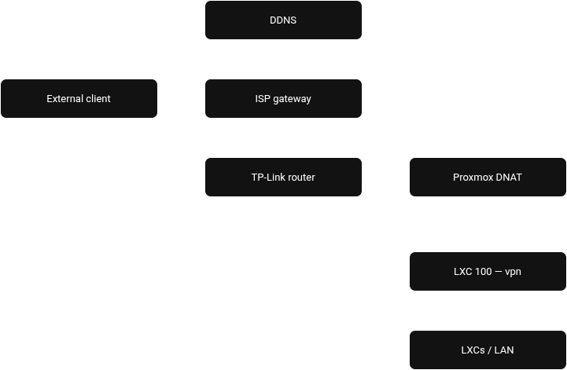

# WireGuard + DDNS

Remote access VPN.

## LXC

| Param | Value |
|-------|-------|
| ID | `<LXC_VPN_ID>` |
| IP | `<LXC_VPN_IP>` |
| Hostname | vpn |
| RAM | 256 MB |
| Disk | 4 GB |

## Access

- Port: `<VPN_PORT>` UDP
- Domain: `<VPN_DDNS_DOMAIN>` (No-IP)

## DDNS

- Provider: No-IP
- Update: TP-Link TL-WR940N router, DDNS key

## Clients

| Name | VPN IP | Profile |
|------|--------|---------|
| pc | `<VPN_CLIENT_PC>` | wg0 (external) |
| phone | `<VPN_CLIENT_PHONE>` | wg0 (external) |

## Decisions

- Combined LXC for WireGuard + DDNS (DDNS client runs on the router, not the LXC)
- wg0: external profile (Endpoint `<VPN_DDNS_DOMAIN>`), AllowedIPs 0.0.0.0/0
- Route `<LXC_SUBNET>` via `<IP_HOST_LAN>` required for LAN access from VPN
- No PostUp/PostDown in wg0.conf: iptables managed by iptables-persistent

## Port forward

- ISP Gateway => `<ISP_GATEWAY_WAN>:<VPN_PORT>` UDP => `<IP_HOST_WAN>:<VPN_PORT>` (TP-Link WAN)
- TP-Link (`<ROUTER_IP>`) => `<IP_HOST_LAN>:<VPN_PORT>` UDP => Proxmox
- Proxmox DNAT: `<WIFI_INTERFACE>` => `<LXC_VPN_IP>:<VPN_PORT>`

## iptables

All rules persisted with `iptables-persistent` (`/etc/iptables/rules.v4`).

**FORWARD:**
- Accept all traffic from `wg0`
- Accept established/related return traffic

**NAT POSTROUTING:**
- Masquerade VPN subnet (`<VPN_SUBNET>`) outbound via `eth0`

**NAT PREROUTING (DNS):**
- DNAT port 53 UDP/TCP from `wg0` => Pi-hole (`<LXC_DNS_IP>:53`)
- Client DNS set to `<VPN_SERVER_IP>` — queries hit this LXC and are forwarded to Pi-hole

See `examples/iptables-rules.v4`.

## Examples

| File | Destination |
|------|-------------|
| `examples/wg0-server.conf` | `/etc/wireguard/wg0.conf` on LXC vpn |
| `examples/wg0-client.conf` | `/etc/wireguard/wg0.conf` on client |
| `examples/iptables-rules.v4` | `/etc/iptables/rules.v4` on LXC vpn |